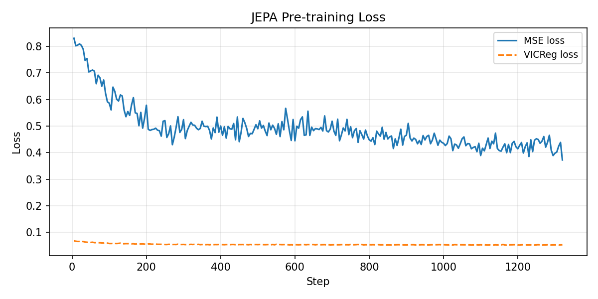
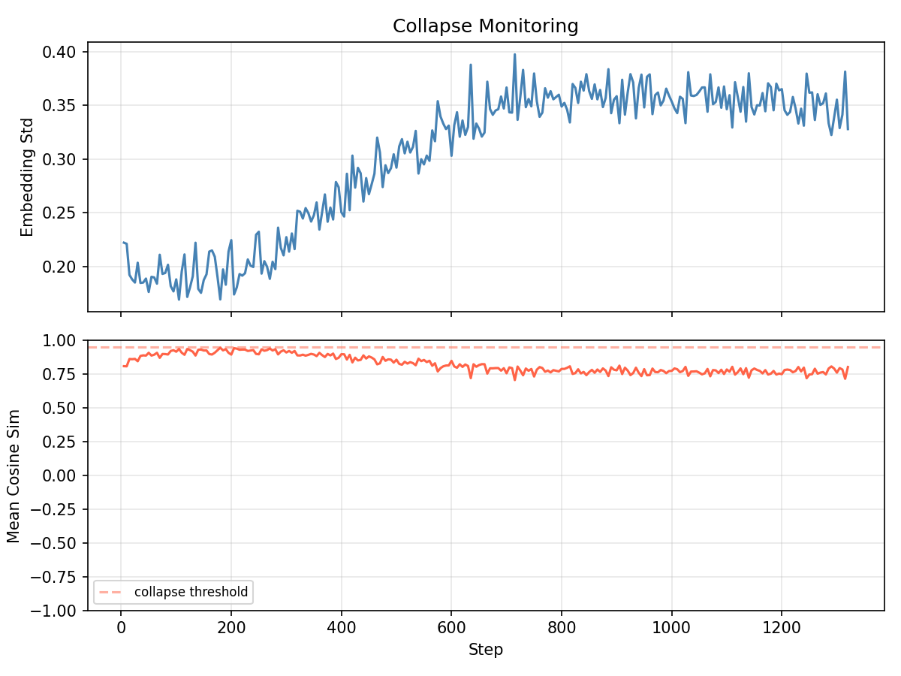

# jepa-script

A JEPA (Joint Embedding Predictive Architecture) trained on a deliberately small,
syntactically rigid programming language. The constrained vocabulary (~62 tokens:
digits, registers, arithmetic, control flow, I/O) makes structural masking
tractable and gives the latent space a clear ground truth to learn against.

Pre-training is self-supervised. Downstream heads for next-token prediction and
sequence classification are fine-tuned on top of the frozen (or lightly tuned)
encoder backbone.

---

## Architecture

### The language

Fixed vocabulary. No subword tokenization. Numbers are split digit by digit.
Registers are `r0`-`r15`. Control flow: `if / then / else / endif`,
`while / do / endwhile`, `break`, `continue`. I/O: `input`, `output`.

Example program (factorial):

```
input r0
r1 = 1
while r0 > 1 do
    r1 = r1 * r0
    r0 = r0 - 1
endwhile
output r1
```

### JEPA pre-training

Two transformer encoders trained jointly in latent space. No reconstruction loss.

```
context_encoder   tokens (masked regions replaced by learned mask token)  -->  z_context
target_encoder    same tokens (no mask, EMA copy of context encoder)       -->  z_target
predictor         z_context  -->  z_hat_target
loss              MSE(z_hat_target, z_target) + VICReg(z_context)
```

Key points:

- The target encoder is never updated by gradient descent. Its weights are an
  Exponential Moving Average (EMA) of the context encoder.
- Masking is structural: masked regions are complete syntactic blocks (if-body,
  while-body, or a run of assignment statements), not arbitrary spans.
- The predictor (MLP or shallow transformer) is discarded after pre-training.
- VICReg regularization (variance + covariance terms) prevents representation
  collapse. The right operating point for this dataset size is `lambda_var`
  around 0.08 and `lambda_cov` around 0.04.

### Downstream tasks

After pre-training, only the context encoder is kept.

**Next-token prediction:** the encoder is switched to causal attention, a linear
LM head is added, and the whole stack is fine-tuned on the same corpus with
cross-entropy loss.

**Sequence classification:** the encoder stays bidirectional, representations
are mean-pooled, and a linear classification head is trained. Supported label
types: `has_loop`, `has_conditional`, `has_input`, `return_type`.

---

## Results

Training command that produced the figures below:

```bash
uv run main.py train \
  --data .private/data/snippets \
  --output .private/output/jepa \
  --epochs 60 \
  --batch-size 32 \
  --lr 1e-3 \
  --d-model 128 --n-layers 4 --n-heads 4 \
  --lambda-var 0.08 --lambda-cov 0.04 \
  --grad-clip 1.0 \
  --log-every 5 --save-every 10
```

| Training loss | Collapse metrics |
|---|---|
|  |  |

The collapse metrics plot tracks `embedding_std` (healthy: above 0.3) and
`mean_cosine_sim` (healthy: well below 1.0). With the VICReg settings above,
both stabilize in a good range by epoch 20-30.

---

## Repository layout

```
jepa-script/
    main.py                         CLI entry point  (uv run main.py)
    playground.py                   Gradio web UI for interactive generation
    pyproject.toml
    scripts/
        export_onnx.py              Export model to ONNX
    src/
        language/                   Language runtime (lexer, parser, evaluator)
        tokenizer/                  Vocabulary definition and LanguageTokenizer
        model/                      Context encoder, target encoder, predictor, heads
        data/                       Snippet loading, datasets, structural masking
        training/                   JEPA pre-training loop and VICReg regularization
        tasks/
            next_token/             NTP model and fine-tuning loop
            classification/         Classifier model and fine-tuning loop
        cli/                        train, finetune, predict, embed, compare
    figures/                        Training curve PNGs committed to the repo
    .private/
        data/snippets/              Training data  (snippet_000 ... snippet_NNN)
        output/                     Model checkpoints and final weights
```

---

## Setup

Requires Python 3.13+ and [uv](https://github.com/astral-sh/uv).

```bash
git clone <repo>
cd jepa-script
uv sync
```

---

## Data

Training data lives in `.private/data/snippets/`. Each file contains multiple
programs separated by spec comment lines:

```
// name: Description [param: type, ...] -> return_type
source code
// next_name: ...
```

Load all snippets programmatically:

```python
from src.data.snippet import load_all_snippets

snippets = load_all_snippets('.private/data/snippets')
total = sum(len(s.programs) for s in snippets)
```

---

## Training

### JEPA pre-training

```bash
uv run main.py train \
  --data .private/data/snippets \
  --output .private/output/jepa \
  --epochs 60 \
  --batch-size 32 \
  --lr 1e-3 \
  --d-model 128 --n-layers 4 --n-heads 4 \
  --lambda-var 0.08 --lambda-cov 0.04 \
  --grad-clip 1.0 \
  --save-every 10
```

Key flags:

| Flag | Default | Notes |
|---|---|---|
| `--d-model` | 128 | Embedding dimension |
| `--n-layers` | 4 | Transformer depth |
| `--n-heads` | 4 | Attention heads |
| `--n-blocks` | 1 | Masked blocks per sample |
| `--lambda-var` | 0.08 | VICReg variance term. Raise if cosine sim drifts above 0.7 |
| `--lambda-cov` | 0.04 | VICReg covariance term |
| `--ema-decay` | 0.996 | Target encoder EMA rate |

Outputs written to `--output`:

```
checkpoints/checkpoint_epoch_NNN.pt
jepa_final.pt
context_encoder_final.pt
model_config.json
training_loss.png
collapse_metrics.png
```

**Collapse diagnosis:** watch `emb_std` and `mean_cosine_sim` in the log.
If `mean_cosine_sim` approaches 1.0, raise `--lambda-var`.
If it is suspiciously low (below 0.2), the regularization is too strong: lower both lambda values.

### Next-token prediction fine-tuning

```bash
uv run main.py finetune next-token \
  --pretrained .private/output/jepa/context_encoder_final.pt \
  --data .private/data/snippets \
  --output .private/output/next_token \
  --epochs 30 \
  --batch-size 32 \
  --lr 5e-4 \
  --val-ratio 0.1
```

Add `--freeze-encoder` for linear probing (only the LM head trains).

### Sequence classification fine-tuning

```bash
uv run main.py finetune classify \
  --pretrained .private/output/jepa/context_encoder_final.pt \
  --data .private/data/snippets \
  --label-type has_loop \
  --output .private/output/classify_loop
```

`--label-type` accepts: `has_loop`, `has_conditional`, `has_input`, `return_type`.

---

## Inference

### Embed a program

```bash
MODEL=.private/output/jepa/context_encoder_final.pt

uv run main.py embed --model "$MODEL" "input r0
input r1
output r0 + r1"

# From file, save embedding as .npy
uv run main.py embed --model "$MODEL" -f prog.txt --save out.npy
```

### Compare two programs

```bash
uv run main.py compare --model "$MODEL" "r0 = 1" "r0 = 2"
uv run main.py compare --model "$MODEL" -f prog_a.txt -f prog_b.txt
```

### Next-token prediction

```bash
NTP=.private/output/next_token/next_token_predictor_final.pt

# Per-position accuracy + top-k at last position
uv run main.py predict next-token --model "$NTP" \
  "input r0
r1 = 1
while r0 > 1 do" \
  --top-k 5 --verbose

# Greedy continuation
uv run main.py predict next-token --model "$NTP" \
  "input r0
r1 = 1" \
  --generate 10
```

### Classification

```bash
CLS=.private/output/classify_loop/classifier_final.pt

uv run main.py predict classify --model "$CLS" \
  "r0 = 1
while r0 < 10 do
    r0 = r0 + 1
endwhile"
```

---

## Playground (Gradio)

Interactive web UI with two tabs: generate (greedy continuation) and evaluate
(per-position accuracy + perplexity).

```bash
uv run playground.py --model .private/output/next_token/next_token_predictor_final.pt

# Custom port
uv run playground.py --model PATH --port 8080

# Public Gradio tunnel
uv run playground.py --model PATH --share
```

---

## ONNX export

Exports the model to ONNX with dynamic batch and sequence-length axes, plus
`vocab.json` and `tokenizer.json` for use on the JS side.

```bash
# Next-token prediction model
uv run python scripts/export_onnx.py \
  --model .private/output/next_token/next_token_predictor_final.pt \
  --output .private/output/onnx/next_token

# Context encoder (mean-pooled embeddings)
uv run python scripts/export_onnx.py \
  --task embed \
  --model .private/output/jepa/context_encoder_final.pt \
  --output .private/output/onnx/embed

# With onnxruntime verification pass
# (requires: uv sync --extra verify)
uv run python scripts/export_onnx.py --model ... --output ... --verify
```

Output directory contains:

```
model.onnx          ONNX graph  (input: token_ids int64, output: logits float32)
vocab.json          token_to_id, id_to_token, special token ids
tokenizer.json      Tokenizer rules for the JS side
model_config.json   Encoder architecture
```

---

## TypeScript client (Next.js / Node.js)

`scripts/jepa_client.ts` is a self-contained TypeScript module: tokenizer,
ONNX inference wrapper, and sampling strategies. Copy it alongside the ONNX
export directory into your Next.js project.

```bash
npm install onnxruntime-node   # server / API route
# or
npm install onnxruntime-web    # browser / client component
```

```typescript
import * as ort from 'onnxruntime-node'
import vocabJson from './vocab.json'
import { loadJepa } from './jepa_client'

const { tokenizer, model } = await loadJepa('./model.onnx', vocabJson, ort)

const ids = tokenizer.encode('r0 = input ( )\nr1 =')

// Greedy single step
const nextId = await model.nextToken(ids, { strategy: 'greedy' }, ort)
console.log(tokenizer.idToToken(nextId))

// Stochastic generation -- no model change required, post-processing only
const full = await model.generate(ids, {
  strategy: 'topk',
  k: 10,
  temperature: 0.85,
  maxNewTokens: 30,
  stopAtEos: true,
}, ort)
console.log(tokenizer.tokensToSource(tokenizer.decode(full)))
```

Available sampling strategies, all applied client-side on the raw logits:

| Strategy | Parameters | Behaviour |
|---|---|---|
| `greedy` | none | Always the most probable token |
| `temperature` | `temperature` | Below 1: sharper distribution. Above 1: flatter |
| `topk` | `k`, `temperature` | Restricts to top-k candidates, then samples |
| `topp` | `p`, `temperature` | Nucleus sampling: smallest set covering p of the mass |

---

## License

MIT. See `LICENSE`.
